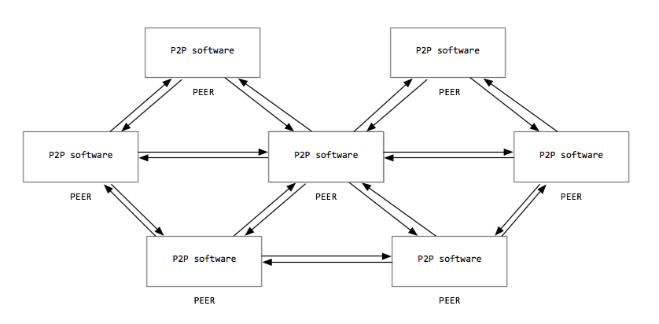

# Basic computer concepts

Here is a quick outline of a minimal set of concepts which you must
familiarize yourself with immediately in order to be ready to learn to
be literate in usage of computers in general, not just for any given
course.

## Files and folders

All the computers we are likely to deal with store data in files. The
word "file" was originally used to discuss data saved on computers
because, back in the 1960's and 70's when [computers began to find
their way into business
life](http://www.computerhistory.org/timeline/1960/), workplaces were
stuffed with paper files placed in folders inside of filing cabinets.
Many workers in that era affectionately referred to themselves as
'paper shufflers'.

Folders (often called "directories"), just like folders in a filing
cabinet, are containers within which to group files. Since a computer
user may often have have hundreds or thousands of files, keeping files
nicely organized inside of clearly labeled folders is an important
aspect of working effectively on a computer.

Unlike in a mid-level job of the 1970's, software developers and
digital media creators today usually do not have secretaries to do the
filing for them. This is very sad, and for this reason, you must learn
to organize your files into folders yourself in such a way that you can
easily keep track of them.

### The paper paradigm and the desktop metaphor

Computer files thus follow a
'[paper-paradigm](https://wikipedia.org/Desktop_metaphor#Paper_paradigm)'
dating to at least the 1960 and 70's. The file systems on computers as
we know them today were intentionally designed to be reminiscent of
those filing cabinets that populated most office buildings of that
bygone era. And computer interfaces were designed to resemble a physical
desks, replete with the trash can underneath (now an eco-friendly
recycling bin). So here we are, still with the [desktop
metaphor](https://wikipedia.org/Desktop_metaphor) in use today.

### Files are not made of paper

Paper files inside of office filing cabinets invariably have something
legible written inside of them, and they are carefully organized into
folders in filing cabinets. This is not really the case with data stored
in computers. Computer files are stored scattered all over a the
computer"s hard drive, rather than physically in a discrete folder in a
well-organized filing cabinet. Even a single file may be scattered all
over the hard drive. And computer files can store many types of data -
some legible, and others completely illegible to the human eye, like
executable programs and raw video data. Furthermore, a computer file can
be 'stored' in many folders at the same time, or even on many
computers at the same time... try doing that with a piece of paper.

To say that computer files are similar to paper files is to gloss over
many of their interesting and useful attributes. [This was, of course,
the point](https://www.youtube.com/watch?v=1UtlOgkOGy4) - making these
strange binary number-crunching devices seem familiar and amenable to
office workers of the 1970s was the goal.

### Other metaphors

You may wonder why we still use the metaphor of a desktop and a filing
cabinet when computers are so obviously nothing like filing cabinets or
desktops. And you may be heartened to hear that some operating systems,
such as Apple OS X and iOS, are increasingly hiding the file cabinet
metaphor from users, although it still exists for developers on these
devices.

And there are other competing paradigms and metaphors currently gaining
currency, such as '[the
cloud](https://www.technologyreview.com/s/425970/who-coined-cloud-computing/)',
originally coined in the early 1990's.

But the classic 1970's desktop with its filing cabinet is still the
predominant metaphor in computing. Is this what is commonly referred to
as the breathtakingly rapid pace of innovation in computing?

## Types of files

Different sorts of data are represented in different ways by a computer.
For our purposes, there are two fundamental kinds of files: text files
and binary files.

### Text files

[Text files](http://en.wikipedia.org/wiki/Text_file) are exactly what
they sound like, a bunch of text. This text can be broken up onto
several lines, or it can be all on one line. The important thing is that
the only things contained inside of the files are text and line-breaks,
and maybe some indents. In other words, the contents of text files
consists of "plain text" - text with no formatting, no other embedded
media, and no hidden content.

Text files are one of the simplest kinds of file. Programmers often
create text files to store all of the source code they write, although
they have many other uses as well.

### Text files are binary files

When we say text files contain only text, this can be a bit misleading,
depending on the context. All data, including text, is fundamentally
stored as numbers ([binary
data](Number_systems#Binary_numbers) in particular) in
memory, storage, and in the computer's processor. So what we really
mean when we call something a 'text file' is that the only data stored
in text files are the binary numbers that represent text characters. So
what are those numbers?

There are various character mapping schemes that map human-readable text
characters to their corresponding computer-friendly binary numbers - a
user sees a text character on the screen, while the computer sees the
corresponding binary number in its memory.
[ASCII](https://en.wikipedia.org/wiki/ASCII) is one such mapping scheme
that was popular in the early days of personal computers. In ASCII, for
example, an 'F' is represented internally in the computer as 0110
(which is the binary number equivalent of what a normal person would
refer to as 6).

ASCII was limited because it only included codes for characters in the
English language, plus a few additional codes related to printing. Other
more modern character mapping schemes are usually extensions of ASCII to
some degree - they usually include the same anglo-centric character
codes from ASCII, plus more codes that support other international
languages. The standard contemporary character mapping system is
[Unicode](https://en.wikipedia.org/wiki/Unicode), which is an extension
and improvement of ASCII.

To sum it up, the term 'text file' refers to any file that exclusively
stores binary data corresponding to ASCII or Unicode characters and
nothing else.

### Binary files

[Binary file](http://en.wikipedia.org/wiki/Binary_files) is a term for
those files used to store other types of data besides just plain text.
The term "binary" just refers to the fact that all data is
fundamentally represented as a series of 1's and 0's. In most applied
computer courses, you will not concern yourself with exactly how binary
data is represented and stored, so long as you understand that binary
files can contain more than just text.

Image files are often stored in a binary format since most images cannot
be adequately represented as lines of text. Image file formats usually
contain a lot of more complex information, including the exact color of
every pixel in the image, and the relative differences between one pixel
and another. Some image file formats store the mathematical formulas
that can be used to recreate the lines and paths in the image at any
scale.

If you try to read binary files in a text editor, you will see a bunch
of garbled text of no use. They are only useful to the specific programs
that know how to read them. So, for example, you need to use image
editing software like Photoshop in order to be able to read a binary
file that was created in Photoshop in the .psd format; you will need to
use a video editing program to edit a video file; and so on. Binary
format files are invariable specific to a particular type of
application.

## Creating and editing files

### Code files are text files

Files for writing computer programs are usually created and edited on
your personal computer. Text files, including any source code you write
in a high level programming language, are created and edited using a
simple [text editor](http://en.wikipedia.org/wiki/Text_editor), a
program that deals exclusively with text files.

### Text editors edit only text

Two good quality free to use text editors for Windows or Mac are
[Sublime Text](https://www.sublimetext.com/) and [Visual Studio
Code](https://code.visualstudio.com/).

An amazing free/libre text editor that comes pre-installed on most Unix
and Linux machines is [emacs](https://www.gnu.org/software/emacs/).
Another popular option for \*NIX machines is
[vim](<https://en.wikipedia.org/wiki/Vim_(text_editor)>).

The text editors that typically come with computers, such as Notepad on
Windows and TextEdit on Mac, are generally not good quality text editors
and should be avoided at all costs.

Word processing software like Microsoft Word and Apple Pages are not
text editors at all - they write much more than plain text data into the
files they save, including formatting instructions, image rendering
data, and other non-text data.

### Binary file editors

The software used to create or edit binary files depends on the sub-type
of binary file. For example, we typically use software such as [Adobe
Photoshop]https://knowledge.kitchen/Category:Photoshop) or [Adobe
Illustrator]https://knowledge.kitchen/Category:Illustrator) when dealing with image
files and audio editing software such as
[Audacity]https://knowledge.kitchen/Category:Audio) when editing audio files.

## File names

In today's world of inter-networked computers, it's important to
follow some basic 'lowest common denominator' file naming conventions
to make sure your files work equally well on whatever type of computer
they happen to be copied to.

**Capitalization**. File names are case-sensitive on \*NIX-based
systems. Windows and Mac systems use filenames that are sometimes
case-sensitive and sometimes not. So, as a general rule, it's best to
assume that the capitalization of your file names is important. A file
named **Foo.bar** is not the same file as one named **foo.bar** on most
computers. So, as a general rule, do not use capital letters in your
file names, except where absolutely necessary. End of story.

**Spaces and special characters**. Operating systems are inconsistent in
how they treat spaces. Even a single type of operating system will be
inconsistent in how its different versions treat spaces in file names.
Even a single computer may be inconsistent between how its GUI treats
spaces vs. how its command-line shell treats spaces. For this reason, do
not use spaces at all in the name of any file you make.

The same applies to special characters. Besides alphabetic and numeric
characters, do not use any special character except the underscore `_`
character and the period `.` character.

## File extensions

As sophisticated computer users, we must always know the exact names of
the files we are dealing with.

A [file extension](http://en.wikipedia.org/wiki/Filename_extension) is
simply a suffix attached to the name of a file. For example, an image
file named "monkey" may have an extension named ".jpg" to indicate
the sub-variety of image data that is stored in the file. So the
complete file name, as far as the operating system is concerned, would
be"monkey.jpg". UNIX, Windows, and Mac each support using file
extensions. Recent versions of Windows and Mac OS X operating systems
hide extensions from you by default. But be warned - the file extension
might be there! To use a computer effectively, you must [change your
operating system's settings so that file extensions are always
visible](File_extension_settings_under_Windows_and_Mac).

The extension typically indicates to the operating system what type of
data is in the file. So image files typically have ".jpg", ".gif",
or ".png" extensions, which indicate the sort of binary image format
which was used to create the image file. Text files written in HTML code
typically have a ".html" or ".htm" file extension, and text files
written in Java usually have a ".java" extension appended to their
file name, etc.

### Default applications for file extensions

The operating system may be programmed to 'know' what to do with a
file when it is double-clicked or executed based on this extension.
However, what the operating system thinks is the correct action to take
on a file when double-clicked is not necessarily the action you as an
expert computer user will want it to take. So you should open files in
the applications you deem correct, rather than accepting what the
operating system thinks is correct.

## File permissions

The file systems on all popular operating systems implement permissions
that restrict who can read, write, and execute any given file or folder.
In general, permissions are granted to three different classes of
potential users:

- user: the user who 'owns' the file or folder... every file or
  folder is owned by one user
- group - a group of users who assigned to
  the file or folder
- others - everyone else not including the user or
  the group

File permissions can be adjusted either through the options in the [file
browsing application](https://knowledge.kitchen/Basic_computer_concepts#Browsing_files)
of an operating system's [Graphical User
Interface](https://knowledge.kitchen/Popular_operating_systems_and_trends#Graphical_User_Interface),
such the 'Properties' context menu in Windows Explorer on Windows or
the 'Info' context menu in Finder on Mac, or [through the UNIX command
line](https://knowledge.kitchen/Basic_UNIX/Linux_file_management#Change_permissions_of_any_file_or_directory).

## Compressed files

There is often a need to reduce the size of files, meaning reducing the
number of bits in them. This might be done in order to preserve limited
hard-drive space, or to make files faster to download over a slow
network connection. There are many different [compression
algorithms](https://en.wikipedia.org/wiki/Data_compression) that are
specialized for reducing the file size of specific kinds of files:
images, videos, music, etc. And there are other algorithms that offer
general-purpose compression that is pretty good for all types of files.
Each of these algorithms takes the original file, compresses the data in
it, and saves this new compressed data into a new file, usually adding a
file extension that indicates which type of compression was used.

Common compression formats:

\- Zip files are one such type of general-purpose compressed type of
file. It is capable of compressing many files and even folders into a
single, smaller, file. This zipped file usually has the .zip file
extension. Most [operating
systems](https://knowledge.kitchen/Popular_operating_systems_and_trends) come built in
with software to create zip files. - There are several very common
compression formats for raster images published on the web, such as
JPEG, GIF, and PNG. These usually have the file extensions .jpg, .gif,
and .png, respectively. - Music is very often compressed using the
mediocre MPEG 3 algorithm, leading to files with .mp3 file extensions. -
Video compression formats include MPEG 4 (.mp4), Quicktime (.mov),
Windows Media (.wmv), and many others.

### Lossy compression

In the process of reducing the amount of space the data takes, some
compression algorithms will actually cut out and lose parts of the data.
These are known as [lossy
compression](https://wikipedia.org/Lossy_compression) formats. Lossy
compression, by its nature, leads to a lower fidelity reproduction of
the original data. Examples of lossy compression algorithms are MP3 and
JPG and many other popular audio, video, and image compression formats.

Lossy compression might be valuable when reducing file size is more
important than maintaining fidelity. For example, an audio track
streamed from web service to a consumer might use lossy compression to
reduce the file size and increase the speed with which the user can
download the audio to their own device. According to the research of
[psychoacoustics](https://en.wikipedia.org/wiki/Psychoacoustics#Limits_of_perception),
an audio track may contain audio data that a human is not possible of
perceiving - this data can thus be safely removed, reducing the amount
of data that needs to be transferred, without the risk of the human
noticing the difference.

### Lossless compression

In some cases, it is undesirable to lose any of the data in the original
medium. In these cases, a variety of [lossless
compression](https://wikipedia.org/Lossless_compression) algorithms are
available. An example of a lossless compression format is the ZIP
format. Zipping up files does not lose any of their data. PNG and GIF
are lossless raster image compression formats, and many others in the
world of audio, video, and image compression exist as well.

### Lossiness versus quality

When it comes to audio, video, and imagery, where exact replicas of
original content are not necessary, bear in mind that lossless
compression, perhaps counterintuitively, does not always equate to
higher quality. For example, converting a highly detailed image from a
digital camera to a low bit-depth but lossless format, such as GIF, will
always make the image appear lower quality than converting to a lossy
but higher bit depth compression format, such as JPG. And removing data
from a media file that is imperceptible from a human will not lead to a
perceived loss of quality, whereas slower download of streaming video or
audio leading to interruptions of the sound or video feed most certainly
will.

Conversely, when retaining the integrity of the data is of utmost
importance, a lossless compression format is the only choice. For
example, when sending files over a network from one computer to another,
such as sharing a written document or a folder full of documents, a
lossless compression such as ZIP, will always be preferable to lossy
compression where some of the data gets lost along the way and the files
become corrupted and unusable.

## Operating systems

[Operating systems](https://knowledge.kitchen/Popular_operating_systems_and_trends)
define the ways in which you, the human, access the resources available
on a computer. And they also make sure that the hardware resources of
the computer are shared nicely among all the different programs that are
running. Personal computers generally have one of three flavors of
operating system: Mac OS X, Windows, or a variety of UNIX/Linux
(sometimes written collectively as \*NIX). Each provides more or less
the same functionality for our purposes, but do so in slightly different
ways.

If you ever become a software developer, you may have to deal, at some
point, with each of these types of operating systems. Most web servers,
which are the computers where you store websites, such as the computer
which stores this site, run a variety of
[UNIX](http://en.wikipedia.org/wiki/Unix). Most people who use the
internet do so on personal computers running [Microsoft
Windows](http://en.wikipedia.org/wiki/Microsoft_windows). Apple Macs,
which are generally more expensive than Windows computers, use the
operating system [OS X](http://en.wikipedia.org/wiki/Mac_OS_X), and are
used by a small but significant minority or internet users, including a
large proportion of design professionals. Most people accessing the
internet on mobile devices use Google's [Android operating
system](<https://wikipedia.org/Android_(operating_system)>), a variant of
Linux, with most other mobile users having Apple's [iOS operating
system](https://wikipedia.org/iOS), a variant of OS X.

The computer you are using right now to view this document is, I am 99%
sure, a personal computer running Windows or OS X. If you"re, in fact,
using UNIX or Linux right now, you are an unusual character.

## Applications

Applications are simply programs that depend upon on a particular
operating system in order to be able to run. For example, Microsoft Word
is an application that requires a specific operating system to run.
There is a version of Microsoft Word for Mac OS X and another version of
Microsoft Word for Windows 10. Since each operating system has a
slightly different GUI and a slightly different way of handling the
hardware resources of the computer, the applications have to be created
with a specific operating system in mind in order to be able to take
advantage of those features of the operating system.

## Browsing files

On your personal computers, you will often have to find the files you
downloaded, created, or copied so that you can use them or edit them.
Finding files (and losing them) is a big problem for the typical person,
even those who use computers every day. But if you have organized your
files into clearly labeled folders, and understand the structure of the
computer"s file system, managing files will be a simple job.

Finding files is basically the same, whether you are using Windows or
Mac OS X. [Windows
Explorer](http://en.wikipedia.org/wiki/Windows_Explorer) is the tool you
use on a Windows PC. [Mac
Finder](http://en.wikipedia.org/wiki/Finder_29) is the tool you use on a
Mac OS X computer.

Files are stored on a computer hierarchically. What this means is that
files on the computer are organized in folders, and these folders can be
put into other folders. Mac Finder illustrates this nicely:

In this screenshot of Mac Finder, you can see that each folder on a
drive can contains several sub-folders, and those sub-folders can
contain their own sub-folders. Files can be stored within any folder,
even if that folder also contains other sub-folders as well.

Windows Explorer looks very similar. All folders and files are nested
inside of a drive just as in the Mac. Although it is less intuitive, the
concept behind Windows Explorer is the same as with Mac Finder: it
allows you to navigate through folders within folders within folders" a
filing cabinet metaphor being stretched thin"

## Opening files

When you double-click a file on a standard computer, the operating
system reads the file's extension, and uses that to determine which
Application it should run in order to open the file you clicked on. In
order to do this, the operating system keeps a mapping of which file
extensions are used by each Application. For example, if you
double-click a file ending in .docx, a computer that has Microsoft Word
installed on it will most likely open that file in Microsoft Word,
because the operating system has a mapping between the file extension
.docx and the application Microsoft Word.

Very often, as an educated computer user, you want to open a file in a
different Application than what the operating system launches by
default. The solution to this is simple - stop double-clicking files
that you want to open! Rather, open the application that you want to use
first. Then, from within that application, open the file you're
interested in by using the application's File menu.

## The working directory

When browsing files on a hard drive, only one directory on your file
system is being actively looked at at any given time. This is known as
your "current working directory", or just "working directory". This
is the case whether you are browsing the files on your hard drive using
the command line, a graphical user interface, or a program you've
written.

## Clients and servers

### in general

The terms "client" and "server" are often used to describe the roles
of any two computers that are communicating with one-another on a
network. A client computer requests data from a server computer. A
server serves data to a client.

These roles can switch. A computer that is a client one minute, may
become a server the next minute, and vice versa.

### on the web

Your personal computer, the one you use to browse the web and read this
amazing site, is often called a
'[client](http://en.wikipedia.org/wiki/Client_29)'. This term is used
to differentiate your desktop computer or mobile device from the web
'[servers](http://en.wikipedia.org/wiki/Server_29)' that permanently
store the web pages (which are simply [text
files](#Text_files) with [ HTML
code]https://knowledge.kitchen/Category:HTML) in them) that you visit.

Web servers make the data stored on them available to the public by
allowing any other computer to connect to them and ask for the files.
Your personal computers probably don't give your files to anonymous
creeps on the Internet (euphemistically called
['others'](#File_permissions) internally on the server), so
it does not usually act as a web server, although it could be set up as
one.

This website, like all other websites, consists of a bunch of data
stored on a web server. Servers are computers dedicated to hosting and
serving data when they are requested by clients. Thus the [World Wide
Web](https://en.wikipedia.org/wiki/World_Wide_Web), at a high level, is
composed of two types of computers: clients and servers.

### hardware vs software clients

The [software products you use to connect to
servers](#Web_browsers) are also sometimes referred to as
clients. Thus the term client can either refer to the computer you use
to request data from a server, or the particular software product you
use to do so, depending on the context of the conversation. The point
being that the client is the "thing" you use to access the content
available on the server.

### uploading and downloading

- Uploading is the transfer of data from a client to a server
- Downloading is the transfer of data from a server to a client

### A note about peer-to-peer networks

There are some situations, such as with [Peer-to-peer file
sharing](http://en.wikipedia.org/wiki/Peer-to-peer_file_sharing), where
any given computer simultaneously acts as both client and server. Even
in such circumstances, we generally talk about each computer as working
either as a client or a server, depending on the context of the
discussion.

### in sum

Servers "serve" files to clients. Clients request a particular web
page file from the server, and the server responds with the contents of
that file.

## Web browsers

A web browser is a piece of software that runs on the client computer.
It allows the user of the client machine (i.e. _you_) to browse files
(i.e. web pages) that are stored on web servers (i.e. computers)
connected to the Internet and [made available to anyone to
view](https://knowledge.kitchen/Basic_UNIX/Linux_file_management#Change_permissions_of_any_file_or_directory).

## The internet vs. the web

The [internet](http://en.wikipedia.org/wiki/Internet) and the
[web](http://en.wikipedia.org/wiki/World_Wide_Web) are two separate but
related things.

The "internet" refers to the global network of interconnected
computers. It is the infrastructure that allows computers around the
globe to communicate with each other.

The "web" refers to the vast number of interlinking
[hypertext](http://en.wikipedia.org/wiki/Hypertext) documents that exist
on the internet. Thus the web generally refers to only those parts of
the internet that are accessible via the
[HTTP](http://en.wikipedia.org/wiki/Hypertext_Transfer_Protocol) or
HTTPS protocol.

The web is just one usage of the internet, and HTTP is just one of many
protocols supported by the internet. Other technologies that rely upon
the internet but are not directly related to the web include email
([IMAP](http://en.wikipedia.org/wiki/Internet_Message_Access_Protocol)
and [POP](http://en.wikipedia.org/wiki/Post_Office_Protocol) protocols),
file transfer
([FTP](http://en.wikipedia.org/wiki/File_Transfer_Protocol) and
[SSH](http://en.wikipedia.org/wiki/Secure_Shell) protocols),
[VoIP](http://en.wikipedia.org/wiki/Voice_over_Internet_Protocol),
streaming media such as webcams and internet radio, and
[P2P](http://en.wikipedia.org/wiki/Peer-to-peer) file sharing
([RTP](http://en.wikipedia.org/wiki/Real-time_Transport_Protocol)
protocol and other proprietary protocols), among others.
