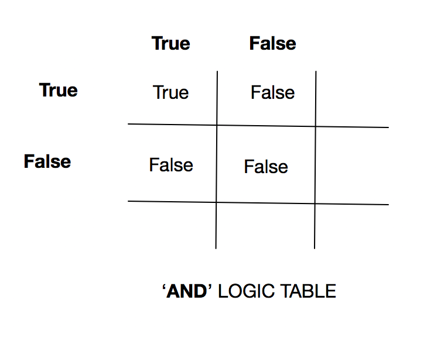
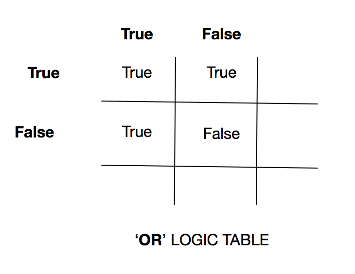
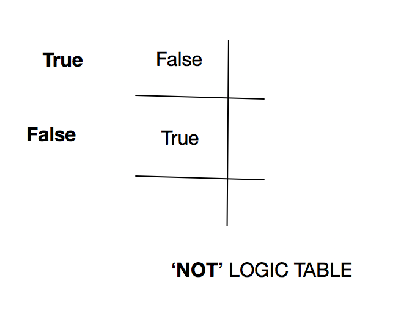

# Boolean logic

## Boolean values

In Boolean logic, named after [George
Boole](wikipedia:George_Boole "wikilink"), any given expression will
ultimately have only one of two values: true or false.

## Boolean literals

There are [Boolean
literals](Variables,_literals,_and_expressions#Boolean_literals "wikilink")
to represent each of these values in code.

### Python

In Python, Boolean literals are written in uppercase.

- True
- False

### Java, Javascript, PHP

In most high-level programming languages, Boolean literals are written
lowercase.

- true
- false

## Boolean logic operators

Boolean logic operators (and, or, and not) work much the same way as
they are used in regular English speech.

### AND

The AND logic operator is used to evaluate two Boolean values according
to the following truth table:


AND requires that two expressions both be true in order for the entire
expression to evaluate to true. In all other cases, the expression
evaluates to false.

Imagine the following phrase in code, \"If today is Monday **and** I
work as a plumber, then I must go to work today.\"

#### Python

```
today = "Monday"
my_job = "plumber"
if today == "Tuesday" and my_job == "plumber":
    print("Get to work!")
```

The above example has the day hard-coded as \"Monday\". Here\'s an
alternate version of the same program that determines the true the day
of the week:

```
#the datetime module can return the day of the week as an int between 0 to 6, representing the days from Monday to Sunday
import datetime
today = datetime.datetime.today().weekday()
my_job = "plumber"
if today == 2 and my_job == "plumber":
    print("Get to work!")
```

#### Java

```
String today = "Monday";
String myJob = "plumber";
if (today.equals("Tuesday") && myJob == "plumber") {
    System.out.println("Get to work!");
}
```

### OR

The OR logic operator is used to evaluate two Boolean values according
to the following truth table:


If one or more values in an OR expression evaluates is true, the entire
expression is true. If both values are false, the entire expression
evaluates to false.

Imagine the following phrase in code, \"If I\'m feeling lazy or
overworked, I\'m going to take the day off.\"

#### Python

```
feeling = "lazy"
horribly_overworked = False
if feeling == "lazy" or horribly_overworked == True:
    print("Take the day off!")
```

#### Java

```
String feeling = "lazy";
boolean horriblyOverworked = false;
if (feeling.equals("lazy") || horriblyOverworked == true) {
    System.out.println("Take the day off!");
}
```

### NOT

The NOT logic operator is used to evaluate a single Boolean values and
flip it to its invert:


NOT logic simply reverses a Boolean value. If something was true, it
becomes false. If it was false, it becomes true.

Imagine the following phrase in code, \"If this is not fun, then why am
I doing it?\"

#### Python

```
this_is_fun = False
if not this_is_fun:
   print("Then why are you doing this?")
```

#### Java

```
boolean thisIsFun = false;
if (!thisIsFun) {
    System.out.println("Then why are you doing this?");
}
```

## Boolean comparison operators

Most high-level programming languages have the same set of comparison
operators that, when used in an expression, always result in a Boolean
value:

- ==
- !=
- \<
- \>
- \<=
- \>=

### The == matrix

"==" is a comparison operator. It evaluates an expression to be true if
the two sides of the operator have the same value.

- 5 == 5 (is true)
- \"A\" == \"B\" (is false)
- false == false (is true)
- false == true (is false)

===The != matrix===

The opposite of the "==" operator. It evaluates an expression to true if
the two sides of the operator do NOT have the same value.

- 5 != 5 (is false)
- \"A\" != \"B\" (is true)
- false != false (is false)
- false != true (is true)
