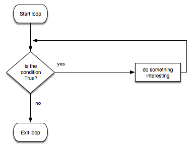

# Loops recap

## For loops

[For loops](loops-for.md) iterate through a finite sequence of values.

- finite loops
- lists `[0,1,2,3,4,5]`
- lists `['a', 'b', 'c', 'd']`
- `range(x)`
- `range(x, y)`
- `range(-x, -y)`
- `range(x, y, z)`
- `range(x, y,-z)`

Iterate through strings, lists, ranges, or files:

- for i in `<string>`:
- for i in `<list>`:
- for i in `<range>`:
- for i in `<file>`:


## While loops

[While loops](loops-while.md) repeat a potentially unfinite number of iterations.

- indefinite loops
  - Since while loop is indefinite loops, when for loop is definite, it is better to use while loop to set up the conditions that have to be satisfied to prevent the program from crashing.
- condition-based loops
- accumulator pattern
  - running totals



## General loop controls

- `break`
- `continue`

## Input validation

- repeating until valid input given

## Flags/sentinels

- keeping track of state

## Formatting

- converting Strings to uppercase or lowercase in order to make validation case-insensitive

## Example programs in Python

### Number validation example

Note the use of the while loops to indefinitely iterate until an acceptable number has been entered.

```python
msg = "What's your lucky integer"

num = ""

while not num.isnumeric():
    num = input(msg)

num = int(num)

while num != 50:
    print("Sorry, that's not right.")
    num = int(input("What's your favorite number?"))
```

### Name validation example

Note the use of the while loop to indefinitely iterate until an
acceptable name has been entered.

```python
name = input("What's your name").lower()

while not name == "bob":
   name = input("What's your name?")

print("Hi Bob!")
```

### Running total example

Note the use of a flag, the accumulator pattern, and the while loop

```python
hoursTotal = 0

keepLooping = True #start the flag as true

#keep looping as long as the flag is true
while keepLooping:

    #set the starting point of our variable to make the loop kick in
    num = "foo"

    while not num.isnumeric():
        num = input("Please enter a number of hours:")
        if num.lower() == "stop":
            keepLooping = False #set the flag to false
            break #break out of immediate while loop

    #if the user entered stop, break out of the main while loop
    if not keepLooping:
        break

    #this only executes if the user entered a number
    num = int(num)

    hoursTotal = hoursTotal + num


print("You worked " + str(hoursTotal) + " hours total")
```
