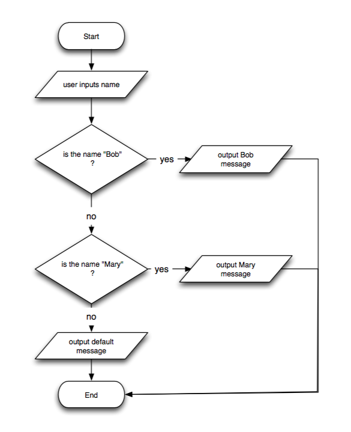

# Decision-making

Decision-making in programs, sometimes called \'selection\',
\'branching\', or \'conditionals\', is allowing a program decide
semi-autonomously what to do in a given situation.

High-level programming languages typically rely on if/elseif/else
statements to allow a program to evaluate Boolean conditions and execute
different blocks of code depending upon the outcome of those conditions.

## Python examples

### Personal fruit preference validator

The following program shows a simple usage of a conditional if/elif/else
statement. In this example, we are asking the user to input their
favorite fruit. The program then responds differently depending upon
what was entered. Here is an overview of what the program does:

- It first checks to see whether the user entered the word, "orange".
  If the user did enter that word, the program outputs a message and
  skips to the end of the if/elif/else statement.
- If the user did not enter the word, "orange", the program checks to
  see if the user entered the word, "apple". If the user did enter
  that word, the program outputs a message and skips to the end of the
  if/elif/else statement.
- If the user did not enter the word "apple", the program checks to
  see if the user entered the word, "strawberry". If the user did
  enter that word, the program outputs a message and skips to the end
  of the if/elif/else statement.
- If the user did not enter the word, "strawberry", the program
  outputs a default message, "never heard of it", and then continues
  on to run the code underneath the if/elif/else statement.

```
#
#filename: fruit.py
#author: yours truly
#
#an example of using an if/elif/else conditional statement

#ask the user what their favorite fruit is and store the answer in a variable
x = input("What is your favorite fruit?")

#check the value of the variable against four different conditions
if x == "orange":
    print("Yes, oranges are very nice")
elif x == "apple":
    print("boring")
elif x == "strawberry":
    print("not in season")
else:
    print("never heard of it")

#output a generic message
print("thanks!")

#end of program
```

### Jacket recommendation

Example of a program that recommends a jacket based on temperature and
precipitation.

#### Simple version

```

#this will be on the exam!!!!
#not exactly, but in spirit

temp = input("What's the temperature (e.g. 35)?")
precipitation = input("What sort of precipitation is there, if any?")

#rainjacket - precipitation: rain, drizzle temp: 5F - 60F
#rainjacket - precipitation: sleet, hail; temp: 32F - ?
#winter jacket - precipitation: snow, hail, sleet; temp: 0 - 32F
#winter jacket - precipitation: clear, none; temp <=32F
#no jacket - precipitation: clear, none; temp: 60F - ?

temp = int(temp)

if (precipitation == "rain" or precipitation == "drizzle") and (temp >=5 and temp  <= 60) :
    print("Wear a rain jacket, please!")

elif (precipitation == "sleet" or precipitation == "hail") and (temp >= 32):
    print("Wear a rain jacket, please!")

elif (precipitation == "snow" or precipitation == "sleet" or precipitation ==  "hail") and (temp >=0 and temp <=32):
    print("Wear a Canada Goose winter jacket, please!")

elif (precipitation == "clear" or precipitation == "none") and (temp <=32):
    print("Wear a North Face jacket.")

elif (precipitation == "clear" or precipitation == "none") and (temp >=60):
    print("Don't wear a jacket")

else:
    #catch-all... be sure that you have accounted for all other conditions
    print("Please dress at your best judgment.")
```

#### Advanced version

Allows temperature to be entered as Celsius or Farenheit. Farenheit is
the default, in case units are not entered.

```
#this will be on the exam!!!!
#not exactly, but in spirit

temp = input("What's the temperature (e.g. 35F, 35C)?")
precipitation = input("What sort of precipitation is there, if any?")

#check if the user entered Celsius or Farenheit
units = temp[len(temp) - 1] #e.g. C or F

if units.isnumeric():
    temp = int(temp)
    units = "F"
else:
    temp = temp[0:(len(temp) - 1)] #e.g. 35
    temp = int(temp) #convert string to int

#if the user entered celsius
if units == "C":
    temp = temp * (9/5) + 32 #convert to farenheight

#rainjacket - precipitation: rain, drizzle temp: 5F - 60F
#rainjacket - precipitation: sleet, hail; temp: 32F - ?
#winter jacket - precipitation: snow, hail, sleet; temp: 0 - 32F
#winter jacket - precipitation: clear, none; temp <=32F
#no jacket - precipitation: clear, none; temp: 60F - ?


if (precipitation == "rain" or precipitation == "drizzle") and (temp >=5 and temp  <= 60) :
    print("Wear a rain jacket, please!")

elif (precipitation == "sleet" or precipitation == "hail") and (temp >= 32):
    print("Wear a rain jacket, please!")

elif (precipitation == "snow" or precipitation == "sleet" or precipitation ==  "hail") and (temp >=0 and temp <=32):
    print("Wear a Canada Goose winter jacket, please!")

elif (precipitation == "clear" or precipitation == "none") and (temp <=32):
    print("Wear a North Face jacket.")

elif (precipitation == "clear" or precipitation == "none") and (temp >=60):
    print("Don't wear a jacket")

else:
    #catch-all... be sure that you have accounted for all other conditions
    print("Please dress at your best judgment.")
```

### Example program with nested branches

This program, which assumes an understanding of
[functions](Functions "wikilink"), is an example of a job application
self-evaluation tool. It asks the user to enter their desired job, and
then runs through a series of questions to determine how suited the
candidate is for that job. We have only designed the code for the \"fry
cook\" job.

```
def doCashierStuff():
    #this is where you would put cashier questions
    print("Welcome to the cashier application center")

def doBusBoyStuff():
    #this is where you would put bus boy questions
    print("Welcome to the bus boy application center")

def doManagementStuff():
    #this is where you would put management questions
    print("Welcome to the management application center")


def doFryCookStuff():
    yearsExperience = input("How many years food-related experience do you have? ")
    age = input("How old are you? ")
    hasFoodCert = input("Do you have a food-handling certificate? ")
    agreesToGiveAwayRights = input("Do you agree to sign away your right to litigate against us? ")

    isValidCandidate = True
    isExcellentCandidate = False

    if isValidCandidate and hasFoodCert.lower() != "yes":
        print("Your chances are not so great because of the high level of competition for fry cooks these days.  Please consider a job as a cashier instead.")
        agreesToGetCert = input("Do you promise to obtain legal food handling certification within 2 weeks?")
        if agreesToGetCert.lower() != "yes":
            print("Your application has been withdrawn.  Good luck!")
            isValidCandidate = False
        else:
            print("Great, thanks for being cooperative.")

    if isValidCandidate and int(age) < 16:
        print("Sorry, you're too young... You may want to consider working as a bus boy.")
        isValidCandidate = False
        print("Sending you to the bus boy application process...")
        doBusBoyStuff()

    if isValidCandidate and int(yearsExperience) <= 1:
        #warn them about their chances
        print("Your chances, frankly speaking, are not great.")
        #follow-up questions
        hasOtherRelevantExperience = input("Do you have other relevant experience?")
        otherExperience = input("Oh, what other experience do you have?")
        if hasOtherRelevantExperience.lower() != "yes":
            print("Sorry, we're looking for people with more experience than you can offer.")
            isValidCandidate = False

    elif isValidCandidate and int(yearsExperience) <= 5:
        #they are a good candidate
        #encourage them
        print("You sound like a great candidate for fry cook.")
        #ask follow-up questions
        willingToWorkOvertime = input("Are you willing to work overtime, if necessary?")
        if willingToWorkOvertime.lower() == "yes":
            print("Great, that will help you a lot!")
            isExcellentCandidate = True

    elif isValidCandidate:
        #these people are over qualified
        #be suspicious about their motivation taking such a job
        print("Why would you want to take such a job, given your vast experience?")
        print("Sorry, we have many more appropriate candidates... consider moving into management.")

        interestedInManagement = input("Would you like me to refer you to the management recruiting process?")
        if interestedInManagement.lower() == "yes":
            doManagementStuff()

    if isValidCandidate:
        print("Great, thanks for speaking with us... we'll get back to you shortly about this job.")


#start
#output welcome message
print("Welcome to the job self-evaluation tool")

#ask user for job title
jobTitle = input("Please enter the job you're interested in: ")

#if job is fry cook, then do this first branch
if jobTitle == "fry cook":
    #do the fry-cook stuff
    doFryCookStuff()

elif jobTitle == "cashier":
    #do the cashier-relted stuff
    doCashierStuff()
else:
    #do default stuff
    #don't worry about this for now
    print("coming soon...")
```

## Java examples

### Example of if/else if/else statement

#### Code

```
package edu.nyu.cs.fb1258;

import java.util.Scanner;

/**
 * Example of using the String .equals() function to get boolean values.
 * @author Foo Barstein
 * @version 1
 */

public class BooleanLogicExample {

   public static void main(String[] args) {
       // TODO Auto-generated method stub

       System.out.println("Please enter your name");
       Scanner scan = new Scanner(System.in);
       String name = scan.nextLine();
       String lowercaseName = name.toLowerCase();

       if (lowercaseName.equals("bob")) {
           System.out.println("Hello, Bob!");
       }
       else if (lowercaseName.equals("mary")) {
           System.out.println("Hello Mary!");
       }
       else {
           System.out.println("Hello, " + name + ", whoever you are.");
       }

       scan.close(); //close the scanner to be polite
   }

}
```

#### Flow chart

Flow chart of the same program\...


### Example of switch/case statement

```
/**
 * This program is an example of the  switch/case statement, and how you can use it to select and branch  the flow of your code
 * @author Foo Barstein
 * @version 0.999
 */

package edu.nyu.cs.fb1258;

import java.util.Scanner;

public class SwitchCaseExample {

   /**
    * This method is the only method and does  everything
    * @param args Arguments supplied to the  program when it is launched
    */
   public static void main(String[] args) {

       //ask the user to enter input
       System.out.println("Please enter your  favorite fruit:");

       //capture the input
       Scanner input = new Scanner(System.in);
       String response = input.nextLine();

       //branch the program depending upon  what the user entered
       switch (response) {

           case "apple":
           case "apples":
               System.out.println("You can  make a sharlotka cake with  those!");
               break;
           case "peach":
           case "peaches":
               System.out.println("You can  make a peach cobbler. Yum.");
               break;
           case "watermelon":
           case "watermelons":
               System.out.println("You can  make watermelon gaspacho");
               break;
           case "banana":
           case "bananas":
               System.out.println("You can  ferment a fine organic banana  wine... if you're 21 or over");
               break;
           default:
               System.out.println("I'm not  sure what you can do with those. ..");
               break;
       }


       System.out.println("The end.");

       //close the scanner leak
       input.close();

   }

}
```

### Boolean logic practice examples

```
/**
 * A boolean logic warm-up.
 * @author Foo Barstein
 * @version 100.1
 */
package edu.nyu.cs.fb1258;

public class BooleanLogicExample {

   /**
    * Method to check a boolean condition and  display a meaningful message.
    * @param args
    */
   public static void main(String[] args) {

       boolean isTrue = false;

       if (isTrue && (true && !true)) {
           System.out.println("It's true that true and true and true, yes  it is.");
       }
       else {
           System.out.println("No, it's not  true at all");
       }

   }

}
```

```
/**
* Of course literals and variables are interchangeable as far as Boolean logic is concerned.  The operators work fine either way.
*
* @author Foo Barstein
* @version 10.2
*
*/
package edu.nyu.cs.fb1258;

public class BooleanComparisonExample {

   public static void main(String[] args) {
       boolean x = true;
       boolean y = false;

       if (!x || !y && !x || y != y) {
           System.out.println("The condition is true!");
       }
       else {
           System.out.println("The condition was not true");
       }

   }

}
```

```
package edu.nyu.cs.fb1258;

/**
 * Boolean comparison operators work as you might expect.
 *
 * @author Foo Barstein
 * @version 99.9
 */

public class BooleanComparisonOperatorExample {

   public static void main(String[] args) {

       //use comparison opeartor, like <, <=, >, >=
       int x = 5;
       int y = 10;

       if (x < y) {
           System.out.println("Yes, 5 is less than 10");
       }
       else {
           System.out.println("You will never run this line  of code, regardless of whether you killed my  father.");
       }

       //== and !=
       if (x == y) {
           System.out.println("Yes, 5 is the same as 10!");
       }
       else if (x != 5) {
           System.out.println("Right! 5 is not 5!");
       }
       else if (x <= y) {
           System.out.println("Correct! 5 is less than or  equal to 10!");
       }
       else {
           System.out.println("Not sure... thinking about  it.");
       }


   }

}
```

```
package edu.nyu.cs.fb1258;

import java.util.Scanner;

/**
 * Intuitively named variables make your code more readable.
 * @author Foo Barstein
 * @version 100
 */
public class ExampleOfBooleanOperators {

   public static void main(String[] args) {

       //example of AND operator
       boolean myNameIsInigoMontoya = true;
       boolean youKilledMyFather = false;
       boolean overall = myNameIsInigoMontoya &&  youKilledMyFather; // do an AND operation

       //example of OR operator
       boolean todayIsWednesday = true;
       boolean todayIsTuesday = false;
       boolean todayIsEitherWednesdayOrTuesday =  todayIsWednesday || todayIsTuesday;

       //example of NOT operator
       boolean isFriday = false;
       boolean isNotFriday = !isFriday;

       //practical example
       Scanner s = new Scanner(System.in);
       System.out.println("Please enter your name: ");
       String username = s.nextLine();

       if (!username.equals("Karl") && isFriday &&  youKilledMyFather) {
           System.out.println("You should ask more questions  like this!");
       }
       else {
           System.out.println("All we can say is... either  your name is Karl or you did not kill my father or  today is not friday.");
       }

   }

}
```

### Example of using the modulus operator

```
/**
 * This program shows an example of using the  modulus operator.
 * @author Foo Barstein
 * @version 0.91
 */

package com.onepotcooking.cs.examples;

import java.util.Scanner;

public class ModulusOperatorExample {

   /**
    * Method asks the user to enter an even  number, verifies whether the number is  indeed even, and outputs a meaningful  response.
    * @param args
    */
   public static void main(String[] args) {

       System.out.println("Please enter an  even number:");

       //create a flag to indicate whether the  user has supplied an even number
       boolean isEven = false;

       Scanner input = new Scanner(System.in);
       int response = input.nextInt();

       //check to see whether the number is  even
       if (response % 2 == 0) {
           // if it is, raise the flag
           isEven = true;
       }

       //output a meaningful response
       if (isEven) {
           System.out.println("Thanks for the  even number :)");
       }
       else {
           System.out.println("Thanks for  nothing.  This number is not even.") ;
       }

       System.out.println("The end.");


   }

}
```
